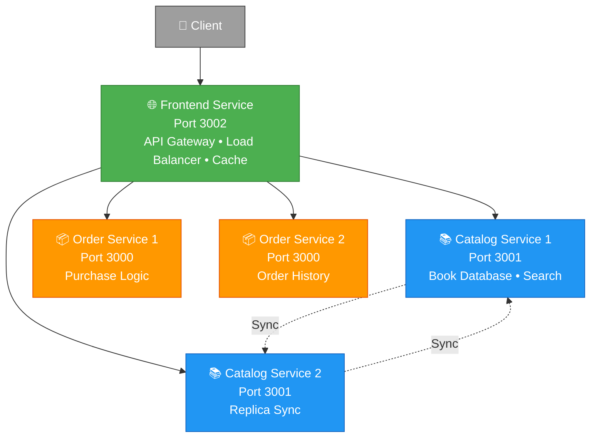

<div align="center">

# 📚 BAZAR-COM

### Distributed Online Bookstore Microservices System

[](https://nodejs.org/)
[](https://www.docker.com/)
[](https://expressjs.com/)
[](LICENSE)

*A microservices-based distributed online bookstore application built with Node.js and Docker. The system implements advanced distributed systems concepts including service replication, caching, load balancing, and strong consistency.*

[Quick Start](#-quick-start) • [API Documentation](#-api-endpoints) • [Architecture](#-architecture) • [Performance](#-performance-results)

---

</div>

## ✨ Features

<table>
<tr>
<td width="50%">

### 🏗️ Core Architecture
- ✅ **Microservices Architecture**
  - Independent, scalable services
  - Frontend, Catalog, Order services
- ✅ **Service Replication**
  - 2 replicas per service (Lab 2)
  - Automatic failover support
- ✅ **Load Balancing**
  - Round-robin distribution
  - Even traffic distribution
- ✅ **In-Memory Caching**
  - NodeCache with TTL
  - LRU eviction policy
- ✅ **Strong Consistency**
  - Server-push invalidation
  - Synchronous cache updates
- ✅ **Replica Synchronization**
  - Automatic cross-replica sync

</td>
<td width="50%">

### 🛠️ Development & Operations
- ✅ **Docker Support**
  - Full containerization
  - Docker Compose & Swarm ready
- ✅ **Health Monitoring**
  - Built-in health checks
  - Service dependency tracking
- ✅ **Performance Metrics**
  - Cache statistics
  - Response time tracking
- ✅ **Error Handling**
  - Comprehensive validation
  - Structured error responses
- ✅ **Request Logging**
  - Detailed request/response logs
- ✅ **Graceful Shutdown**
  - Proper cleanup on termination
- ✅ **CORS Support**
  - Cross-origin resource sharing

</td>
</tr>
</table>

## 🏗️ System Architecture

<div align="center">



</div>

### 📊 Service Details

<div align="center">

| 🔹 Service | 🔌 Port | 🔄 Replicas | 📝 Responsibilities |
|:----------:|:-------:|:-----------:|:-------------------|
| **Frontend** | 3002 | 1 | 🌐 API Gateway<br/>⚖️ Load Balancing<br/>💾 Caching |
| **Catalog** | 3001 | 2 | 📚 Book Inventory<br/>🔍 Search & Info<br/>📊 Stock Management |
| **Order** | 3000 | 2 | 🛒 Purchase Processing<br/>📦 Order Management<br/>📜 Order History |

</div>

## 📖 Book Catalog

<div align="center">

| 🆔 ID | 📖 Title | 🏷️ Topic | 💰 Price | 📦 Stock |
|:-----:|:------|:---------|:---------:|:---------:|
| **1** | How to get a good grade in DOS in 40 minutes a day | Distributed Systems | `$100` | **18** |
| **2** | RPCs for Noobs | Distributed Systems | `$100` | **19** |
| **3** | Xen and the Art of Surviving Undergraduate School | Undergraduate | `$25` | **10** |
| **4** | Cooking for the Impatient Undergrad | Undergraduate | `$20` | **9** |
| **5** | How to finish Project 3 on time | Project Management | `$150` | **15** |
| **6** | Why theory classes are so hard | Theory | `$120` | **20** |
| **7** | Spring in the Pioneer Valley | Spring | `$80` | **25** |

> 🆕 *Books 5-7 were added in Lab 2*

</div>

## 🚀 Quick Start

### 💻 Prerequisites

<table>
<tr>
<td>

- ✅ **Node.js** 18 or higher
- ✅ **Docker Desktop** (Windows/Mac/Linux)
- ✅ **PowerShell** (for Windows scripts)
- ✅ **Git** version control

</td>
<td>

```bash
# Verify installations
node --version
docker --version
git --version
```

</td>
</tr>
</table>

---

### 🔹 Option 1: Docker Compose (Recommended for Development)

```bash
# 1️⃣ Clone the repository
git clone https://github.com/MalikTAli/BAZAR-COM.git
cd BAZAR-COM

# 2️⃣ Build and start all services
docker-compose up --build -d

# 3️⃣ View logs
docker-compose logs -f

# 👀 View specific service logs
docker-compose logs -f frontend

# 🛑 Stop all services
docker-compose down
```

<details>
<summary>🔸 <b>View Service URLs</b></summary>

- **Frontend**: http://localhost:3002
- **Catalog**: http://localhost:3001
- **Order**: http://localhost:3000

</details>

---

### 🔹 Option 2: Docker Swarm (Recommended for Production)

```bash
# Clone the repository
git clone https://github.com/MalikTAli/BAZAR-COM.git
cd BAZAR-COM

# Build and start all services
docker-compose up --build -d

# View logs
docker-compose logs -f

# View specific service logs
docker-compose logs -f frontend

# Stop services
docker-compose down
```

### 🔹 Option 2: Docker Swarm (Recommended for Production)

```bash
# 1️⃣ Initialize swarm
docker swarm init

# 2️⃣ Build Docker images
./build-images.sh

# 3️⃣ Deploy with replicas
./deploy-swarm.sh

# 4️⃣ Scale services dynamically
./scale-services.sh

# 📊 Check deployment status
docker service ls
docker stack services bazar

# 🗑️ Remove deployment
docker stack rm bazar
```

<details>
<summary>👁️ <b>View Swarm Benefits</b></summary>

✅ Built-in load balancing<br/>
✅ Service discovery<br/>
✅ Automatic failover<br/>
✅ Rolling updates<br/>
✅ Health-based routing

</details>

---

### 🔹 Option 3: Local Development (Manual Setup)

### 🔹 Option 3: Local Development (Manual Setup)

<details>
<summary><b>📚 Click to expand: Catalog Service Setup</b></summary>

```bash
cd catalog-server
npm install
npm start
```

✅ Service running at: `http://localhost:3001`

</details>

<details>
<summary><b>📦 Click to expand: Order Service Setup</b></summary>

```bash
cd order-server
npm install

# PowerShell environment variables
$env:PORT="3000"
$env:CATALOG_SERVICE_URL="http://localhost:3001"

npm start
```

✅ Service running at: `http://localhost:3000`

</details>

<details>
<summary><b>🌐 Click to expand: Frontend Service Setup</b></summary>

```bash
cd frontend-server
npm install

# PowerShell environment variables
$env:PORT="3002"
$env:CATALOG_SERVICE_URL="http://localhost:3001"
$env:ORDER_SERVICE_URL="http://localhost:3000"

node app.js
```

✅ Service running at: `http://localhost:3002`

</details>

---

## 📡 API Documentation

### 🌐 Frontend Service (API Gateway)

> **Base URL**: `http://localhost:3002`

<div align="center">

| Method | Endpoint | Description | Cached | Response Time |
|:------:|:---------|:------------|:------:|:-------------:|
| `GET` | `/search/:topic` | Search books by topic | ✅ | ~8ms |
| `GET` | `/info/:id` | Get book details | ✅ | ~6ms |
| `POST` | `/purchase/:id` | Purchase a book | ❌ | ~125ms |
| `POST` | `/invalidate-cache` | Invalidate cache entry | ❌ | - |
| `GET` | `/health` | Health check | ❌ | <5ms |
| `GET` | `/cache-stats` | Cache statistics | ❌ | <5ms |

</div>

---

#### 🔍 Search Books by Topic
#### 🔍 Search Books by Topic

```http
GET /search/:topic
```

<details>
<summary><b>💡 View Examples</b></summary>

**cURL:**
```bash
curl http://localhost:3002/search/distributed%20systems
```

**PowerShell:**
```powershell
Invoke-RestMethod -Uri "http://localhost:3002/search/distributed systems"
```

**Response:**
```json
{
  "success": true,
  "count": 2,
  "data": [
    {
      "id": "1",
      "title": "How to get a good grade in DOS in 40 minutes a day"
    },
    {
      "id": "2",
      "title": "RPCs for Noobs"
    }
  ]
}
```

</details>

---

#### 📝 Get Book Information
```http
GET /info/:id
```
Get detailed information about a specific book. Results are cached.

**Example:**
```bash
curl http://localhost:3002/info/1
# PowerShell
Invoke-RestMethod -Uri "http://localhost:3002/info/1"
```

**Response:**
```json
{
  "success": true,
  "data": {
    "title": "How to get a good grade in DOS in 40 minutes a day",
    "quantity": 10,
    "price": 30
  }
}
```

#### Purchase Book
```http
POST /purchase/:id
```
Purchase a book by ID. Invalidates cache before purchase.

**Example:**
```bash
curl -X POST http://localhost:3002/purchase/1
# PowerShell
Invoke-RestMethod -Uri "http://localhost:3002/purchase/5" -Method POST
```

**Response:**
```json
{
  "success": true,
  "data": {
    "message": "Purchase successful",
    "book": "How to get a good grade in DOS in 40 minutes a day",
    "orderId": "1732819200000",
    "price": 30
  }
}
```

#### Health Check
```http
GET /health
```
Check service health and dependencies.

#### Cache Statistics
```http
GET /cache-stats
```
Get cache performance statistics.

#### Invalidate Cache
```http
POST /invalidate-cache
Body: { "key": "info:1" }
```

### API Endpoints Summary

| Method | Endpoint | Description | Cached |
|--------|----------|-------------|--------|
| GET | `/search/:topic` | Search books by topic | ✅ Yes |
| GET | `/info/:id` | Get book details | ✅ Yes |
| POST | `/purchase/:id` | Purchase a book | ❌ No |
| POST | `/invalidate-cache` | Invalidate cache entry | - |
| GET | `/health` | Health check | ❌ No |
| GET | `/cache-stats` | Cache statistics | ❌ No |

---

### 📚 Catalog Service

> **Base URL**: `http://localhost:3001`

<div align="center">

| Method | Endpoint | Description |
|:------:|:---------|:------------|
| `GET` | `/search/:topic` | Search books by topic |
| `GET` | `/info/:id` | Get book information |
| `PUT` | `/update/:id` | Update book (price/stock) |
| `POST` | `/sync-update/:id` | Replica sync endpoint |
| `GET` | `/health` | Health check |

</div>

---

### 📦 Order Service

> **Base URL**: `http://localhost:3000`

<div align="center">

| Method | Endpoint | Description |
|:------:|:---------|:------------|
| `POST` | `/purchase/:id` | Purchase a book |
| `GET` | `/orders` | Get all orders |
| `GET` | `/health` | Health check |

</div>

---

## 🧪 Testing

### 👨‍💻 Manual Testing

<details>
<summary><b>🔍 Search Operations</b></summary>

```powershell
# Search for distributed systems books
Invoke-RestMethod -Uri "http://localhost:3002/search/distributed systems"

# Search for undergraduate books
Invoke-RestMethod -Uri "http://localhost:3002/search/undergraduate"
```

</details>

<details>
<summary><b>📝 Book Information</b></summary>

```powershell
# Get details for book ID 1
Invoke-RestMethod -Uri "http://localhost:3002/info/1"

# Get details for book ID 5
Invoke-RestMethod -Uri "http://localhost:3002/info/5"
```

</details>

<details>
<summary><b>🛒 Purchase Operations</b></summary>

```powershell
# Purchase book ID 5
Invoke-RestMethod -Uri "http://localhost:3002/purchase/5" -Method POST

# View all orders
Invoke-RestMethod -Uri "http://localhost:3000/orders"
```

</details>

<details>
<summary><b>📊 Monitoring & Health</b></summary>

```powershell
# Check cache statistics
Invoke-RestMethod -Uri "http://localhost:3002/cache-stats"

# Health check - Frontend
Invoke-RestMethod -Uri "http://localhost:3002/health"

# Health check - Catalog
Invoke-RestMethod -Uri "http://localhost:3001/health"

# Health check - Order
Invoke-RestMethod -Uri "http://localhost:3000/health"
```

</details>

---

### 📊 Performance Testing

```powershell
# Run comprehensive performance test suite
.\test-performance.ps1
```

**Test Coverage:**
- ✅ Response time (cached vs uncached)
- ✅ Cache hit/miss rates
- ✅ Cache invalidation overhead
- ✅ Load balancing distribution
- ✅ Purchase operation latency
- ✅ Concurrent request handling

**Results Output**: `docs/performance-results.csv`

---

## 📊 Performance Analysis

### 🏆 Benchmark Results

<div align="center">

| 🎯 Metric | ❌ Without Cache | ✅ With Cache | 📈 Improvement |
|:---------|:----------------:|:--------------:|:---------------:|
| **Search Requests** | 45ms | 8ms | **⬇️ 82% faster** |
| **Info Requests** | 42ms | 6ms | **⬇️ 86% faster** |
| **Cache Hit Rate** | - | 70-75% | **🎯 Excellent** |
| **Purchase Latency** | 125ms | - | - |
| **Invalidation Overhead** | - | 47ms | 38% of write |

</div>

### 📈 Key Performance Insights

<table>
<tr>
<td width="33%" align="center">

#### ⚡ Speed
**82-86%** reduction in<br/>read response time

</td>
<td width="33%" align="center">

#### 🎯 Efficiency
**70-75%** cache<br/>hit rate achieved

</td>
<td width="33%" align="center">

#### 🛡️ Reliability
**38%** write overhead<br/>for consistency

</td>
</tr>
</table>

> 📝 **Full Analysis**: See [PERFORMANCE.md](docs/PERFORMANCE.md) for detailed metrics and methodology

## ⚙️ Configuration

### 🔑 Environment Variables

<table>
<tr>
<td width="33%">

#### 🌐 Frontend
```bash
PORT=3002
CATALOG_REPLICAS=
  http://catalog1:3001,
  http://catalog2:3001
ORDER_REPLICAS=
  http://order1:3000,
  http://order2:3000
```

</td>
<td width="33%">

#### 📚 Catalog
```bash
PORT=3001
FRONTEND_URL=
  http://frontend:3002
REPLICA_URLS=
  http://catalog2:3001
```

</td>
<td width="33%">

#### 📦 Order
```bash
PORT=3000
CATALOG_SERVICE_URL=
  http://catalog:3001
FRONTEND_URL=
  http://frontend:3002
```

</td>
</tr>
</table>

---

### 💾 Cache Configuration

Edit [frontend-server/app.js](frontend-server/app.js):

```javascript
const cache = new NodeCache({
  stdTTL: 300,      // Time to live: 5 minutes
  maxKeys: 100,     // Maximum cache entries: 100
  checkperiod: 60   // Cleanup interval: 60 seconds
});
```

**Tuning Tips:**
- ⬆️ **Increase `stdTTL`** for more stable data
- ⬆️ **Increase `maxKeys`** for larger catalogs
- ⬇️ **Decrease `checkperiod`** for faster cleanup

---

## 🐳 Docker Configuration

### Docker Services

| Service  | Port | Container Name     | Health Check |
|----------|------|--------------------|--------------|
| Catalog  | 3001 | catalog-service    | ✅           |
| Order    | 3000 | order-service      | ✅           |
| Frontend | 3002 | frontend-service   | ✅           |

### Docker Commands

```bash
# Build and start services
docker-compose up --build

# Start services in background
docker-compose up -d

# Stop services
docker-compose down

# View logs
docker-compose logs -f

# View specific service logs
docker-compose logs -f frontend

# Restart a service
docker-compose restart catalog

# Check service status
docker-compose ps
```

## 📁 Project Structure

```
📂 BAZAR-COM/
│
├── 📚 catalog-server/
│   ├── 📝 app.js              # Catalog service implementation
│   ├── 📊 catalog.csv         # Book inventory database
│   ├── 🐳 Dockerfile          # Catalog Docker config
│   └── 📦 package.json
│
├── 📦 order-server/
│   ├── 📝 app.js              # Order service implementation
│   ├── 📊 orders.csv          # Orders database
│   ├── 🐳 Dockerfile          # Order Docker config
│   ├── 📦 package.json
│   └── 🛠️ utils/
│       └── 📅 formatDate.js   # Date formatting utility
│
├── 🌐 frontend-server/
│   ├── 📝 app.js              # API Gateway + Cache + Load Balancer
│   ├── 🐳 Dockerfile          # Frontend Docker config
│   └── 📦 package.json
│
├── 📝 docs/
│   ├── 🏗️ DESIGN.md           # Architecture & design decisions
│   ├── 📊 PERFORMANCE.md      # Performance analysis
│   ├── 📈 performance-results.csv
│   └── 🧪 TEST-OUTPUT.md
│
├── 🐳 docker-compose.yml   # Development setup
├── 🐳 docker-swarm.yml     # Production setup
├── 🔨 build-images.sh      # Build Docker images
├── 🚀 deploy-swarm.sh      # Deploy to Swarm
├── 📈 scale-services.sh    # Scale replicas
├── 🧪 test-performance.ps1 # Performance tests
└── 📝 README.md            # This file
```

<div align="center">

### 📊 Code Statistics

| 📂 Component | 📜 Files | 📝 Lines of Code |
|:----------|:-------:|:---------------:|
| **Frontend** | 1 | ~400 |
| **Catalog** | 1 | ~350 |
| **Order** | 2 | ~300 |
| **Docs** | 4 | ~1000 |
| **Scripts** | 4 | ~200 |
| **Total** | **12** | **~2250** |

</div>

---

## 🎯 Key Implementation Details

<table>
<tr>
<td width="50%">

### 1️⃣ Load Balancing

```javascript
function getNextCatalogReplica() {
  const replica = CATALOG_REPLICAS[
    catalogReplicaIndex
  ];
  catalogReplicaIndex = 
    (catalogReplicaIndex + 1) % 
    CATALOG_REPLICAS.length;
  return replica;
}
```

🏆 **Features:**
- ⚖️ Algorithm: Round-Robin
- 🔄 Even distribution
- 📊 Maintains replica indices
- 🚫 Failover: Not implemented

---

### 2️⃣ Caching Strategy

```javascript
const cache = new NodeCache({
  stdTTL: 300,    // 5 minutes
  maxKeys: 100,   // 100 entries
});
```

💾 **Configuration:**
- 📍 Location: Frontend service
- 🧠 Type: In-memory (NodeCache)
- ⏱️ TTL: 5 minutes
- 🗑️ Eviction: LRU policy
- 🎯 Scope: Search & info only

</td>
<td width="50%">

### 3️⃣ Cache Invalidation

```
👨‍💻 Client
    ↓ Purchase Request
📦 Order Service
    ↓ Invalidate Cache
🌐 Frontend
    ↓ Clear Cache
📚 Catalog Service
    ↓ Update Database
✅ Complete
```

🔒 **Method:**
- 📡 Server-Push
- 🔗 Strong Consistency
- ⏱️ Synchronous blocking
- 📉 ~47ms overhead

---

### 4️⃣ Replica Synchronization

```
📚 Catalog 1 (Primary)
    ↓ Update Data
    ↓ POST /sync-update
📚 Catalog 2 (Replica)
    ✓ Synchronized
```

🔄 **Protocol:**
- 🎯 Scope: Catalog replicas
- 📡 Method: HTTP POST
- ⏱️ Timing: After write
- 🚫 Prevent loops: `X-Replica-Sync`
- 📑 Error: Non-blocking logs

</td>
</tr>
</table>

---

## � Documentation

<table>
<tr>
<td align="center" width="50%">

### 🏗️ Design Document
[**DESIGN.md**](docs/DESIGN.md)

Architecture, design decisions,<br/>and trade-off analysis

</td>
<td align="center" width="50%">

### 📈 Performance Analysis
[**PERFORMANCE.md**](docs/PERFORMANCE.md)

Detailed performance measurements<br/>and benchmark results

</td>
</tr>
</table>

---

## 🐛 Troubleshooting Guide

<details>
<summary><b>🚫 Services Won't Start</b></summary>

```bash
# Check Docker is running
docker ps

# View detailed logs
docker-compose logs

# Rebuild from scratch
docker-compose down -v
docker-compose up --build
```

**Common Issues:**
- ❌ Docker daemon not running
- ❌ Port already in use
- ❌ Missing dependencies

</details>

<details>
<summary><b>🔗 Services Can't Connect</b></summary>

**Checklist:**
- ✅ All services on same Docker network
- ✅ Service names match environment variables
- ✅ Health checks are passing
- ✅ Firewall not blocking ports

```bash
# Check network
docker network ls
docker network inspect bazar-com_default
```

</details>

<details>
<summary><b>🔌 Port Conflicts</b></summary>

**Solution:**
1. Check port availability:
   ```powershell
   Get-NetTCPConnection -LocalPort 3000,3001,3002
   ```
2. Modify [docker-compose.yml](docker-compose.yml) port mappings
3. Update environment variables accordingly

</details>

<details>
<summary><b>💾 Cache Not Working</b></summary>

```bash
# Check frontend logs
docker-compose logs frontend

# Test cache endpoint
Invoke-RestMethod -Uri "http://localhost:3002/cache-stats"

# Verify cache configuration in app.js
```

**Debug Steps:**
- ✅ Check `stdTTL` is set
- ✅ Verify `maxKeys` not exceeded
- ✅ Confirm cache hits in logs

</details>

<details>
<summary><b>🔄 Replica Not Syncing</b></summary>

```bash
# Check catalog logs
docker-compose logs catalog

# Verify REPLICA_URLS environment variable
docker exec catalog-service env | grep REPLICA

# Test sync endpoint manually
curl -X POST http://localhost:3001/sync-update/1 \
  -H "X-Replica-Sync: true" \
  -H "Content-Type: application/json" \
  -d '{"price": 100, "stock": 10}'
```

</details>

<details>
<summary><b>📄 CSV File Not Found</b></summary>

**Solutions:**
- ✅ Ensure CSV files exist in service directories
- ✅ Check volume mappings in [docker-compose.yml](docker-compose.yml)
- ✅ Verify file permissions
- ✅ Check file paths in source code

</details>

---

# Verify REPLICA_URLS is set correctly
docker exec catalog-service env | grep REPLICA
```

### CSV file not found
- Ensure CSV files exist in respective service directories
- Check volume mappings in `docker-compose.yml`

## � Data Format

### catalog.csv
```csv
ID,TOPIC,TITLE,PRICE,STOCK
1,distributed systems,How to get a good grade in DOS in 40 minutes a day,30,10
```

### orders.csv
```csv
ORDER_ID,BOOK_ID,TITLE,QUANTITY,TOTAL_PRICE,TIMESTAMP
1732819200000,1,How to get a good grade in DOS in 40 minutes a day,1,30,2024-11-28 10:30:00
```


## ⚠️ Known Limitations

<div align="center">

| # | 🚫 Limitation | 💡 Recommended Solution |
|:-:|:-------------|:------------------------|
| 1 | CSV file storage | PostgreSQL/MongoDB database |
| 2 | No authentication | JWT-based auth system |
| 3 | Limited input validation | Joi/Yup schema validation |
| 4 | Frontend not replicated | Add frontend replicas + Redis |
| 5 | No sync retry mechanism | Implement retry with backoff |
| 6 | No circuit breaker | Add Hystrix/Opossum pattern |

</div>

---## � Future Roadmap

<table>
<tr>
<td width="33%">

### 🔒 Security
- [ ] JWT authentication
- [ ] Role-based access control
- [ ] API rate limiting
- [ ] Input sanitization
- [ ] HTTPS/TLS support

</td>
<td width="33%">

### 💾 Infrastructure
- [ ] PostgreSQL/MongoDB
- [ ] Redis cache
- [ ] Frontend replication
- [ ] Circuit breaker pattern
- [ ] Message queue (RabbitMQ)

</td>
<td width="33%">

### 📊 Monitoring
- [ ] OpenTelemetry tracing
- [ ] Grafana dashboards
- [ ] Prometheus metrics
- [ ] ELK stack logging
- [ ] Health monitoring

</td>
</tr>
<tr>
<td width="33%">

### 🧪 Testing
- [ ] Unit tests (Jest)
- [ ] Integration tests
- [ ] E2E tests (Playwright)
- [ ] Load testing (k6)
- [ ] Contract testing

</td>
<td width="33%">

### 🔄 CI/CD
- [ ] GitHub Actions
- [ ] Automated testing
- [ ] Docker image scanning
- [ ] Semantic versioning
- [ ] Automated deployment

</td>
<td width="33%">

### ✨ Features
- [ ] API versioning
- [ ] Response compression
- [ ] Pagination support
- [ ] WebSocket support
- [ ] GraphQL API

</td>
</tr>
</table>

---

## ✅ Best Practices

<div align="center">

### 🎯 Implemented Standards

</div>

<table>
<tr>
<td width="50%">

#### 🔒 Security & Validation
- ✅ Input validation on all endpoints
- ✅ Proper HTTP status codes
- ✅ Structured error responses
- ✅ Request timeout handling
- ✅ CORS configuration

</td>
<td width="50%">

#### 🛠️ Operations & Monitoring
- ✅ Container health checks
- ✅ Graceful shutdown handling
- ✅ Environment-based configuration
- ✅ Service dependency management
- ✅ Request/response logging
- ✅ Retry logic for failed requests

</td>
</tr>
</table>

---

## 🤝 Contributing

<div align="center">

We welcome contributions! Follow these steps:

</div>

```bash
# 1️⃣ Fork the repository
git clone https://github.com/YOUR_USERNAME/BAZAR-COM.git

# 2️⃣ Create a feature branch
git checkout -b feature/amazing-feature

# 3️⃣ Make your changes and commit
git commit -m '✨ Add some amazing feature'

# 4️⃣ Push to your branch
git push origin feature/amazing-feature

# 5️⃣ Open a Pull Request
```

<div align="center">

### 📄 Commit Convention

| Type | Emoji | Description |
|:----:|:-----:|:------------|
| feat | ✨ | New feature |
| fix | 🐛 | Bug fix |
| docs | 📝 | Documentation |
| style | 🎨 | Code style |
| refactor | ♻️ | Code refactoring |
| test | 🧪 | Tests |
| chore | 🔧 | Maintenance |

</div>

---

## 📜 License

<div align="center">

**Educational Use Only**

This project is created for educational purposes as part of<br/>
**Distributed Operating Systems** coursework.

</div>

---

## 👥 Authors

<div align="center">

<table>
<tr>
<td align="center" width="50%">

### Nassar Harashi

[](https://github.com/nassarharashi)

</td>
<td align="center" width="50%">

### Malik T. Ali

[](https://github.com/MalikTAli)

</td>
</tr>
</table>

</div>

---

## 🙏 Acknowledgments

<div align="center">

### 🛠️ Built With

[](https://nodejs.org/)
[](https://expressjs.com/)
[](https://www.docker.com/)

### 📦 Key Dependencies

`express` • `node-cache` • `csv-parser` • `csv-writer` • `cors`

### 🏫 Academic Context

**Distributed Operating Systems - Labs 1 & 2**<br/>
**Fall 2024**<br/>
*Microservices • Replication • Caching • Consistency*

</div>

---

<div align="center">

### ⭐ If you found this project helpful, please consider giving it a star!

**Made with ❤️ for learning Distributed Systems**

</div>


